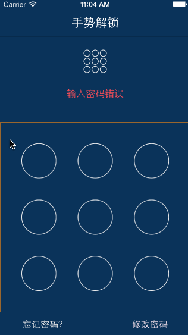

    Charlin出框架的目标：简单、易用、实用、高度封装、绝对解耦！

  

  

框架推荐：CoreModel系列 SERIES
===============

第一季：CoreFMDB
https://github.com/nsdictionary/CoreFMDB

第二季：CoreArchive
https://github.com/nsdictionary/CoreArchive

第三季：CoreClass
https://github.com/nsdictionary/CoreClass

第四季：CoreModel模型动态缓存、列表模型动态缓存。 
暂未开源！请加群归队，获取最新信息（群信息在下面）！！！请支持第三季！

第五季：动态缓存list终结者。 
暂未开源！请加群归队，获取最新信息（群信息在下面）！！！请支持第三季！

   
本框架是隶属于MJExtension续作，我给这系列框架取了一个整体上的名字叫做：CoreModel。
CoreClass是系列第三季，共有5季，还有最后两季！连载中，请加群关注最新动态！ 

  

组织信息 Charlin Feng：
===============
 
#### 特别群：请西部省市朋友实名加入组织。其他地区朋友请添加2-4群：谢谢。
 
【西部区域】西部大开发群号： 473185026  -追赶北上广！为振兴西部IT而努力！ 
热烈欢迎中国西部各省市的从事iOS开发朋友实名进群！本群为是聚集西部零散开发者，大家齐心协力共进退！   

【全国可加】四群： 347446259 
新开，可加！欢迎全国朋友加入组织   

【全国可加】三群： 474377358 
新开，可加！欢迎全国朋友加入组织   

【全国可加】二群： 369870753 
可加  

【全国可加】一群：163865401 
已爆满，加不上了  

  

CoreLock
===============
高仿支付宝解锁！ 

    注：本框架是高仿支付宝，并集成了所有功能，并非一个简单的解锁界面展示。个人制作用时1周多，打造解锁终结者框架。

  
示例截图
===============
 
  

框架特性：
===============
>.ios版本兼容ios 7.0及以上. 
>.扁平化设计，全部使用QuartzCore引擎绘制，没有使用任何图片素材 
>.完全解耦，不需要继承，不需要定义成员属性，类方法直接搞定一切。 
>.自动管理生命周期，你只需要使用即可，不需要管理控制器的生命周期。 
>block封装，不需要任何代理 
>.完美屏幕适配，支持所有ios设备。 
>.做了比较多的性能优化，最大必的提高性能。 
>.完善的错误处理机制。 

  
Charlin想说：
===============
此版本是全部的QuartzCore绘制，整个框架使用了几乎所有的QuartzCore技术，如果你有兴趣，可以看下源代码，
算是一个比较不错的QuartzCore实战教程。

对于本框架，有以下技术点和大家分享： 
1.主界面使用Xib定制，如果你需要添加控件，非常方便，比如支付宝顶部有用户头像，我这里没有，所以就没加，如果你需要加，直接在xib添加即可。 
2.本地数据存储使用沙盒存储。 
3.无任何代理设计，全程使用block解决，引用老刘的一句话，目前代理设计模式正在被块代码所逐步取代。 
4.解锁线条绘制使用的是比较复杂的奇偶裁剪技术。有兴趣可以看看苹果官方示例。 
5.关于QuartzCore，使用到的技术除了基本的绘制以外，还使用了图形上下文栈，矩阵变换，刷新图层等。 
6.本框架考虑了添加密码，修改密码，验证密码，忘记密码等支付宝几乎全部的功能，并且使用简单。 

  

#### 使用示例
    
    /*
     *  设置密码
     */
    - (IBAction)setPwd:(id)sender {
        
        
        BOOL hasPwd = [CLLockVC hasPwd];
        hasPwd = NO;
        if(hasPwd){
            
            NSLog(@"已经设置过密码了，你可以验证或者修改密码");
        }else{
            
            [CLLockVC showSettingLockVCInVC:self successBlock:^(CLLockVC *lockVC, NSString *pwd) {
                
                NSLog(@"密码设置成功");
                [lockVC dismiss:1.0f];
            }];
        }
    }

    /*
     *  验证密码
     */
    - (IBAction)verifyPwd:(id)sender {
        
        BOOL hasPwd = [CLLockVC hasPwd];
        
        if(!hasPwd){
            
            NSLog(@"你还没有设置密码，请先设置密码");
        }else {
            
            [CLLockVC showVerifyLockVCInVC:self forgetPwdBlock:^{
                NSLog(@"忘记密码");
            } successBlock:^(CLLockVC *lockVC, NSString *pwd) {
                NSLog(@"密码正确");
                [lockVC dismiss:1.0f];
            }];
        }
    }

    /*
     *  修改密码
     */
    - (IBAction)modifyPwd:(id)sender {
        
        BOOL hasPwd = [CLLockVC hasPwd];
        
        if(!hasPwd){
            
            NSLog(@"你还没有设置密码，请先设置密码");
            
        }else {
            
            [CLLockVC showModifyLockVCInVC:self successBlock:^(CLLockVC *lockVC, NSString *pwd) {
                
                [lockVC dismiss:.5f];
            }];
        }

    }

  
    

  

